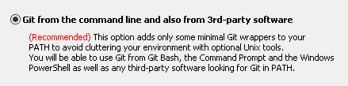
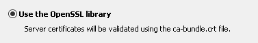
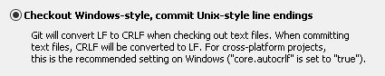
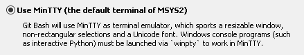
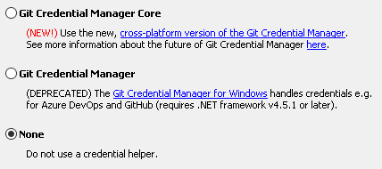
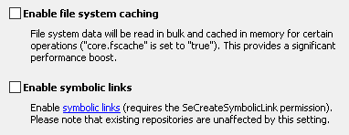
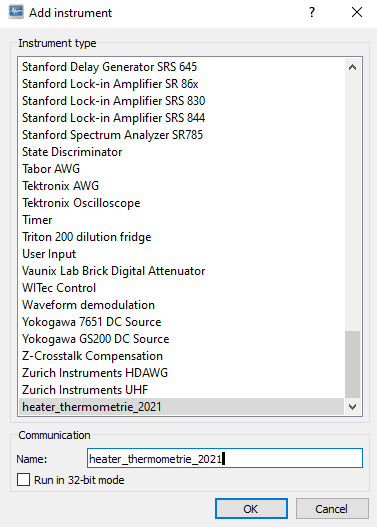

# Installation of Labber Driver for heater_thermometrie_2021

## Pathnames

Tag | Default | Comment
-- | -- | --
`<LABBERDIR>` | `C:\Program Files\Labber` | Labber installation directory
`<LABBERPY32>` | `C:\Program Files\Labber\python-labber-32` | Labber Python 32 bit
`<LABBERPY64>` | `C:\Program Files\Labber\python-labber` | Labber Python 64 bit
`<LABBERDRIVERS>` | `C:\Program Files\Labber\Drivers` | Labber drivers
`<LABBERLOCALDRIVERS>` | `C:\Users\maerki\Labber\Drivers` | Labber local drivers. `maerki` is the logged in user
`<GITBIN>` | `C:\Program Files\Git\bin` | Git binaries

Mapping Tag to Labber Preferences

Tag        | Labber Instrument Server, Menu Preferences
-- | --
`<LABBERDIR>` | Tab Advanced, Application Folder
`<LABBERDRIVERS>` | Tab Folders, Instrument Drivers
`<LABBERLOCALDRIVERS>` | Tab Folders, Local Drivers


## Prerequisits Python 3.7.9 64bit
https://www.python.org/ftp/python/3.7.9/python-3.7.9-amd64.exe
Windows 64bit msi installer
 - Uncheck: Install launcher for all users (recommended)
 - Uncheck: Add Python 3.7 to path
 - Customize installation
   - Check: Documentation
   - Check: pip
   - Uncheck: tcl/tk and IDLE
   - Uncheck: Python test suite
   - Uncheck: pylauncher
   - Uncheck: for all users
 - Advanced
   - Uncheck: Install for all users
   - Uncheck: ALL OTHER OPTIONS
   - `C:\Users\maerki\AppData\Local\Programs\Python\Python37`


### Labber 1.7.7 installed

Install Labber using the installer

### Configure Labber to user Python 3.7.9

Labber Instrument Server Window -> Edit -> Preferences -> Advanced -> Python distribution -> `C:\Users\maerki\AppData\Local\Programs\Python\Python37\python.exe`


### git installed.

Navigate to https://git-scm.com/download/win and download "64-bit Git for Windows Setup". Currently, this is: [Git-2.32.0-64-bit.exe](https://github.com/git-for-windows/git/releases/download/v2.32.0.windows.1/Git-2.32.0-64-bit.exe).















## Install heater_thermometrie_2021 labber driver

### Clone git repository

Run `cmd.exe`:
```bash
cd C:\Users\maerki\Labber\Drivers
git clone https://github.com/nanophysics/heater_thermometrie_2021
cd heater_thermometrie_2021
```

### Install python requirements

Run `cmd.exe` below as **Administrator**.
```bash
cd C:\Users\maerki\Labber\Drivers\heater_thermometrie_2021

"C:\Users\maerki\AppData\Local\Programs\Python\Python37\python.exe" -m pip install --upgrade pip
"C:\Users\maerki\AppData\Local\Programs\Python\Python37\python.exe" -m pip install -r requirements.txt -r requirements_development.txt
```

There will be some warnings about *PATH*. You may ignore them.

The last line should be `Successfully installed ... mpfshell2-100.9.xx ...`!


## Configure the heater_thermometrie_2021 in the Labber Instrument Server

Start the Labber Instrument Server and choose menu `Edit -> Add...`



## Update the heater_thermometrie_2021 driver and calibration data

The driver AND the calibration data is stored in the git repository located at `<LABBERLOCALDRIVERS>\heater_thermometrie_2021`.

Double click `<LABBERLOCALDRIVERS>\heater_thermometrie_2021\run_git_pull.bat` to pull the newest version.
